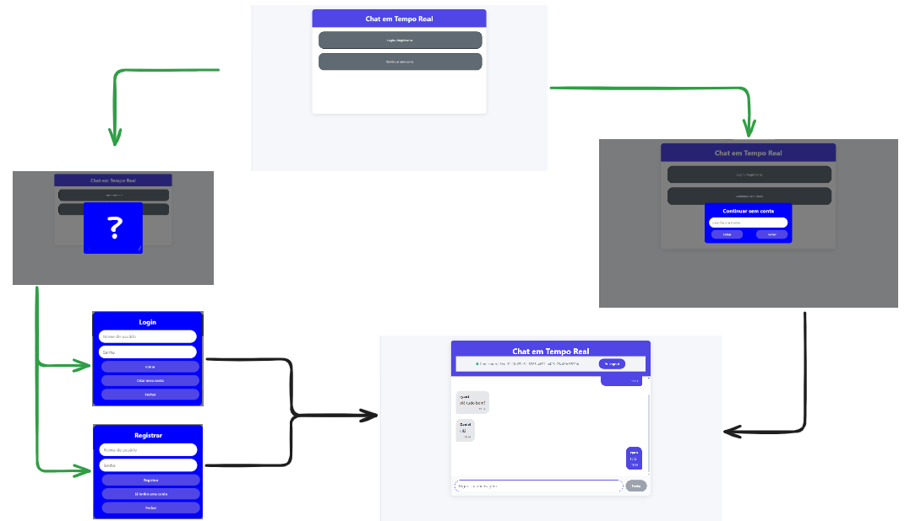
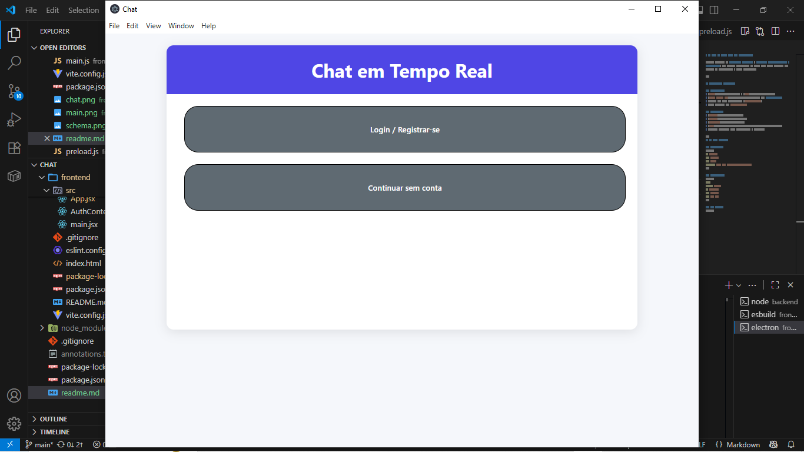

# 💬 Chat em Tempo Real

Projeto dividido em **frontend (React)** e **backend (Node.js/Express + Socket.io)**, que permite comunicação em tempo real entre usuários com sistema de autenticação e rotas protegidas.

---

## Tecnologias Utilizadas

### **Frontend**
- [React](https://react.dev/) + [Vite](https://vitejs.dev/)  
- [React Router DOM](https://reactrouter.com/) com **HashRouter**  
- Context API para autenticação (`AuthProvider`)  
- Rotas privadas com `PrivateRoute`  

### **Backend**
- [Node.js](https://nodejs.org/)  
- [Express](https://expressjs.com/)  
- [Socket.io](https://socket.io/)  
- [CORS](https://expressjs.com/en/resources/middleware/cors.html)  
- Serviços separados para autenticação e mensagens  

---
## Rotas



---
## ▶️ Como Executar

### **Backend**
```bash
cd backend
npm install
npm start
```
> Servidor roda em: http://localhost:3000


### **Frontend**
```bash
cd frontend
npm install
npm run dev
```

### App desktop
```bash
npm run dev
npm start
```


## Autor
- [@Ryan Fernandes Bertaglia](https://github.com/RyanFBertaglia/)
