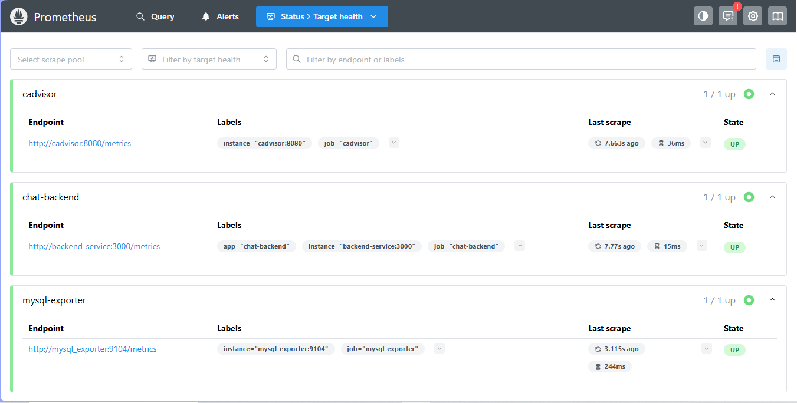
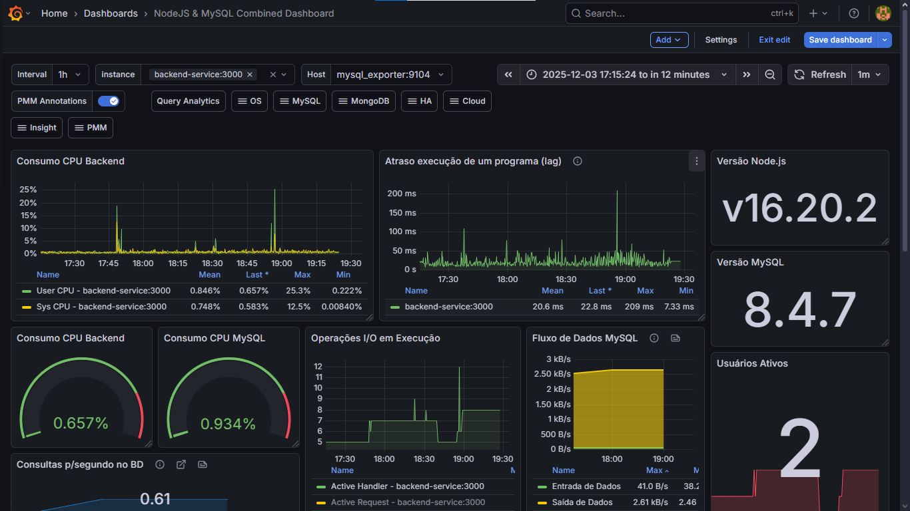

# 💬 Chat em Tempo Real

Projeto dividido em **frontend (React)** e **backend (Node.js/Express + Socket.io)**, que permite comunicação em tempo real entre usuários com sistema de autenticação e rotas protegidas mantendo a observabilidade e portabilidade da aplicação.

---

## Tecnologias Utilizadas

### **Frontend**
- `React` para criar as interfaces + `Vite` para build
- `React Router DOM` para rotear as páginas de maneira controlada 
- Context API para autenticação (`AuthProvider`)  
- Rotas privadas com `PrivateRoute`
- Aplicação Desktop via `Electron`

### **Backend**
- `Node.js` para executar js no lado do servidor
- `Express`para requisições REST
- `Socket.io` para comunicação em tempo real com o cliente (websocket)
- `CORS` para proteção contra acesso de dados por fonte não autorizada
- `JWT` para autenticação/autorização

### **Banco de Dados**
- `MySQL` como banco relacional principal para usuários, autenticação e histórico de mensagens
- `Prometheus MySQL Exporter` para monitorar métricas de desempenho e saúde do banco

### **Monitoramento**
- `Prometheus` para coleta de métricas do backend, banco de dados e serviços
- `Grafana` para visualização de dashboards personalizados
- `Node Exporter` para métricas de CPU, memória e uso do sistema (Backend)
- `MySQL Exporter` para monitorar desempenho do banco de dados
- `Nginx Exporter` para métricas de CPU, memória e uso do sistema (Frontend)


---
## Rotas


---
---

## 📊 Monitoramento com Prometheus e Grafana

O projeto possui um ambiente completo de monitoramento para acompanhar métricas de desempenho, tráfego e estabilidade do backend.

### Prometheus  
Responsável pela coleta e armazenamento de métricas:

- **Prometheus UI:** http://localhost:9090  
- **Regras (Recording Rules):** http://localhost:9090/rules  
- **Alertas configurados:** http://localhost:9090/alerts

 


Coleta métricas de:
- Backend Node.js  
- Node Exporter  
- MySQL Exporter  
- Nginx Exporter  

### Grafana  
Interface visual para criação de dashboards:  
- **URL:** http://localhost:3001 

 


Dashboards incluem:
- Uso de CPU, RAM e event loop do backend  
- Requisições HTTP, latência e status codes  
- Conexões WebSocket ativas  
- Monitoramento em tempo real dos serviços exportados via Prometheus

---

## 🔄 Versionamento com GitHub Actions (CI/CD)

O projeto utiliza GitHub Actions para versionamento do programa quando implementada no feature.

### Pipeline Automático Inclui:
- Instalação de dependências (npm install)
- Build da aplicação React  
- Geração de artefatos de build  
---
## ▶️ Como Executar

O projeto pode ser iniciado facilmente utilizando **Docker Compose**, que sobe o backend, frontend e demais serviços necessários.

### 🐳 Subir todos os serviços
```bash
docker-compose up --build -d
```

### Endpoints após subir os containers
- **Backend:** http://localhost:3000  
- **Frontend:** http://localhost:5173  
- **Prometheus:** http://localhost:9090  
- **Grafana:** http://localhost:3001  

### Parar os serviços
```bash
docker-compose down
```

### Subir em segundo plano
```bash
docker-compose up -d
```

### Build desktop app Manual
```bash
cd frontend
npm install
npm dist
```
#### Após esses comando será criada uma chamada release contendo uma versão descompactada de acordo com o seu SO e um instalador executável que permite a portabilidade da aplicação e a instalação do sistema como um aplicativo em seu dispositivo.

 


## Autor
- [@Ryan Fernandes Bertaglia](https://github.com/RyanFBertaglia/)
