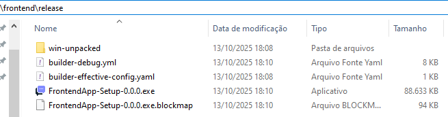

# 💬 Chat em Tempo Real

Projeto dividido em **frontend (React)** e **backend (Node.js/Express + Socket.io)**, que permite comunicação em tempo real entre usuários com sistema de autenticação e rotas protegidas.

---

## Tecnologias Utilizadas

### **Frontend**
- `React` para criar as interfaces + `Vite` para build
- `React Router DOM` para rotear as páginas de maneira controlada 
- Context API para autenticação (`AuthProvider`)  
- Rotas privadas com `PrivateRoute`
- Aplicação Desktop via `Electron`

### **Backend**
- `Node.js` para executar js no lado do servidor
- `Express`para requisições REST
- `Socket.io` para comunicação em tempo real com o cliente (websocket)
- `CORS` para proteção contra acesso de dados por fonte não autorizada
- `JWT` para autenticação/autorização

---
## Rotas


---
## ▶️ Como Executar

### **Backend**
```bash
cd backend
npm install
npm start
```
> Servidor roda em: http://localhost:3000


### **Frontend**
```bash
cd frontend
npm install
npm run dev
```

### App desktop
```bash
npm run dev
npm start
```


### Build desktop app
```bash
npm install
npm dist
```
#### Após esses comando será criada uma chamada release contendo uma versão descompactada de acordo com o seu SO e um instalado .exe que permite a portabilidade da aplicação e a instalação do sistema como um aplicativo em seu dispositivo

 


## Autor
- [@Ryan Fernandes Bertaglia](https://github.com/RyanFBertaglia/)
